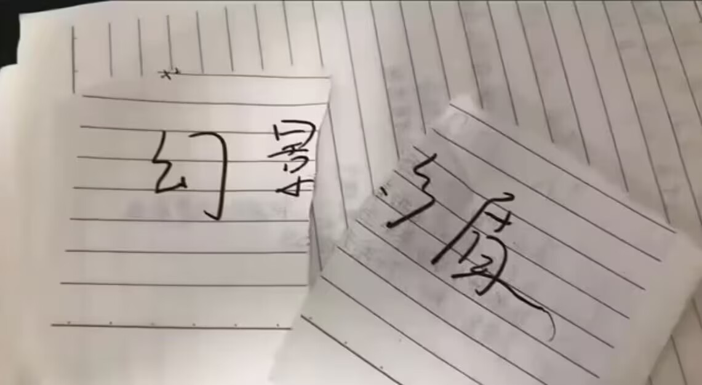
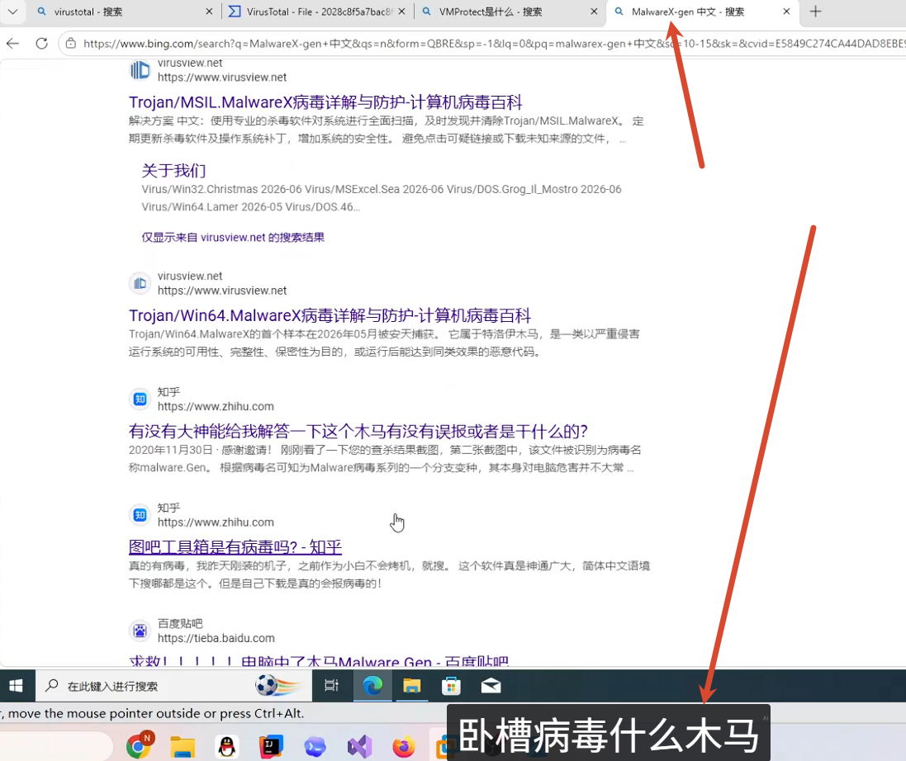
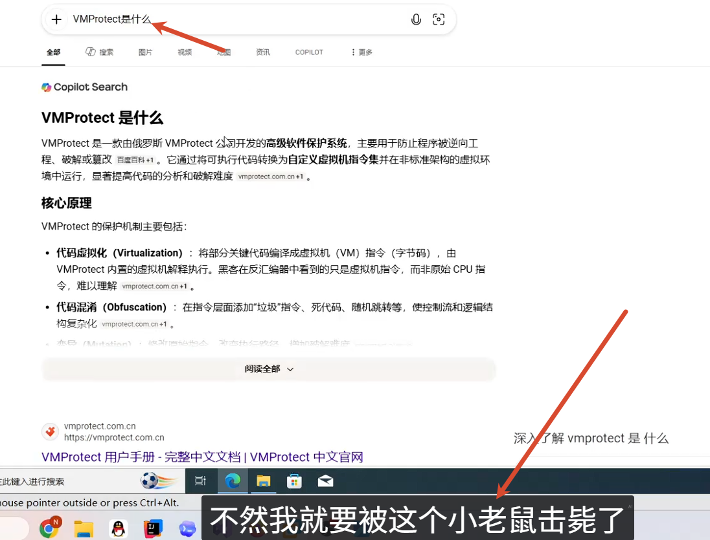
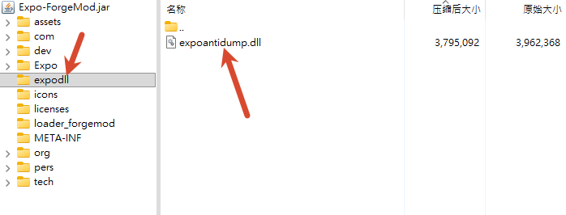
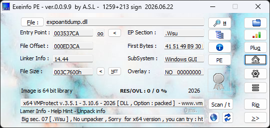
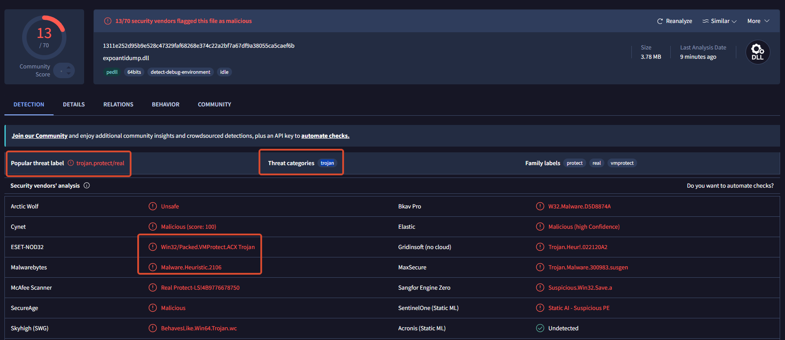
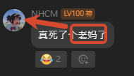
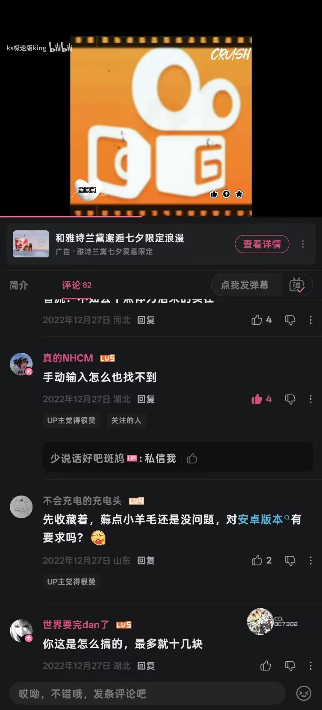
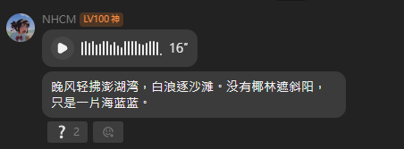

<div style="text-align: center;"><h1>ExpoClient OpenSource</h1></div>

<p align="center">
  
  
</p>


<p align="center">
  
  
  
  
     
  
  
</p>

## Details

<p align="center">
  <strong>Idiomatic American English™</strong> |
  <a href="./README.md">Simplified Chinese</a>
</p>

ExpoClient's a Minecraft cheat client publicly sold back in 2026 by **US intl student** Cai Zihao (aka a self-styled Murican) & **his AI**, based on a stitched-together [OpenMyau](https://github.com/Mornly/OpenMyau-Fix) + Raven base. Target: Minecraft 1.8.9 + Forge.

After Claude™'s 16-sec analysis, we found Expo used [zkm26](https://zelix.com/klassmaster/index.html), [jnic351](https://jnic.dev/), [XiaoShadiao-Obfuscator](https://github.com/SuperShadiao/XiaoShadiao-Obfuscator), [Phantom Shield](https://www.skidonion.tech/), [VMProtect](https://vmpsoft.com/), & [Themida](https://www.oreans.com/themida.php) 2 protect the client. FYI, aside from Phantom Shield + open-source XiaoShadiao, every protector was a **cracked copy**.

Buy this client & u get 6 powerful protections: zkm + jnic + XiaoShadiao + Phantom Shield + vmp + tmd.

W/ Claude™ + manual work, we processed the target client, incl. but not limited 2: **cracked ZelixKlassMaster26**, restoring string encryption in most classes, all `invokedynamic`, reflection, & control-flow obf (limited time + energy, so no 100% deobf).
We also unpacked `expoantidump.dll`, protected by **cracked VMProtect Lite 3.10.4**.
We restored **JNIC** native methods + constants. After unpacking + devirtualizing the **cracked Themida** dug out of an ancient tomb & used by **Phantom Shield**, we restored the JNI methods, then decrypted + restored all classes.

**We don't have enough time + energy 2 achieve 100% deobf or test every feature. If ur willing + capable, join us and submit PRs 2 contribute ur part 2 OpenExpo.**
That said, most classes r still readable and the proj can be built + launched directly.

Finally, after **Opus5™ + Fable5™** repaired this proj, we got this source. lol.

<p align="center">
  
</p>

## If I Had 3 Days 2 Cash In

Note: this client **may** be this way bc Cai Zihao can't write bypasses or visuals (the parts he wrote r pure AI fantasies, & AI finished the skid too, lmao). While watching him, his words + behavior may suggest an [intellectual disability](https://en.wikipedia.org/wiki/Intellectual_disability), & the price shouldn't be what this garbage client is worth; it's way higher than its actual value. So we decided 2 open-source it.

We still don't know if Cai Zihao's got a **brain bleed bc he's a self-styled American** or is just a **broke US intl student**. Using his messed-up "make dollars, spend dollars" logic, he priced the client (per RoseShop) at **up to 60 CNY/mo**, **140 CNY lifetime**, & the hot-injection ver. **sold separately at 170 CNY/yr**. (As of the open-source release, there were at least 400 victims. fr.)

<p align="center">
  
  
</p>
<p align="center">
  
</p>


## Glorious Achievements

### Cai Zihao Flips Overpriced Minecon Accts & Becomes a Scammer

Back in the day, the self-styled Murican scammed ppl + flipped Minecon accts. Everyone dragged him, his whole family's household-registration info got exposed, and he quit the internet + vanished. Now he's back to kissing up, fantasizing, and flexing his imaginary wins. After seeing these glorious achievements, we couldn't help feeling **helpless + sorry 4 ~~his parents~~**, smh.

<p align="center">
  
</p>

- Funny vid: **[American Street Bro NHCM account got struck by lightning](https://b23.tv/YLak7rm)**
- Funny vid #2: **[American Street NHCM loves dancing, just like mice love rice](https://www.bilibili.com/video/BV1wkoUYZEQ5/)**
- Funny vid #3: **[NHCM's little Ren got served justice](https://www.bilibili.com/video/BV1JadpY1EoU/)**

### How Cai Zihao Writes a Client

After the self-styled Murican came back in 2025, he asked how 2 code KillAura head turning. Then, as AI got better, he posted vids + claims abt stuff like **"the strongest client 4 MegaWalls"** and casually beating up other clients. In his latest stream, **40ms bunker Switch showed up nonstop while the XP bar below stayed at 0**. His cheat could barely play Legit. The self-styled Murican still looked goofy af streaming w/ his own cheat and couldn't even turn it on right.
So y r so many ppl still buying it + glazing him? We tried it ourselves, checked his coding level, and collected the stuff Cai Zihao said. The result left us **completely shook**, ngl.

<p align="center">
  
  
</p>
<p align="center">
  
  
</p>
<p align="center">
  
</p>
<p align="center">
  
</p>

### Cai Zihao's Conspiracy Theory

When the self-styled Murican first started writing clients, his cheat got cracked. He later posted a [vid](https://www.bilibili.com/video/BV11KN56AEQ1) responding 2 the crack. His lack of professional knowledge in that vid had us seriously worried abt his IQ. W/o any conclusive evidence, he looked at a VMP-packed + sandboxed binary and decided the crack had a backdoor (**even if it actually did, u still shouldn't reach that conclusion from this alone**), lmao.

<p align="center">
  
  
</p>

If we follow Cai Zihao's god-tier analysis, does that mean `expodll/expoantidump.dll` inside `expo.jar` is a backdoor too? (Reality check: after unpacking + analyzing `expoantidump.dll`, we concluded it has no backdoor.)

<p align="center">
  
  
  
</p>

### Cai Zihao Understands Americans, Becomes American, Then Surpasses Americans

After becoming an intl student in America, Cai Zihao may've gotten his head hit by a car and lost track of his own nationality. He made comments discriminating against Chinese ppl, social status, and education while praising how advanced US tech is. His words + behavior make us wonder if he has [schizophrenia](https://en.wikipedia.org/wiki/Schizophrenia), all while **sucking the blood of his own ppl + worshipping foreign stuff**. He also *may* have made anti-China comments (unverified; more evidence needed, Issues welcome).

<p align="center">
  
  
</p>
<p align="center">
  
  
</p>

## Looking Back

### Dec 27, 2022: Early Cai Zihao Wasn't a Self-Styled Murican Yet. He Was Farming Freebies on the Kuaishou App at Home in **Hubei**, Foreshadowing His Future as a Broke US Intl Student

<p align="center">
  
</p>

### Meanwhile, 1 Yr Ago, Cai Zihao Was Still a **Street Vagrant** Playing PvP on MMC

<p align="center">
  
</p>

### 1 Yr Later, He Became a **Street Beggar**, Building Expo on an **OpenMyau Mixed w/ Raven** Base While Telling Everyone Not 2 Buy Myau. We're Still Clueless Abt This Biting-the-Hand-That-Feeds-U Behavior, Lmao

<p align="center">
  
</p>

### Self-Styled Murican Singing:

<p align="center">
  
</p>

## Requirements

- **JDK 8**
- Gradle Wrapper 8.14.5 (`./gradlew` auto-downloads it)
- **A local Minecraft 1.8.9 dir w/ Forge installed**, incl. `libraries/`
- Net access is required 4 the 1st build. Mainland China may need a VPN (`Maven Central` + `maven.minecraftforge.net` + `libraries.minecraft.net`)
- highiq

## Build + Run

```
./gradlew build
```

Output: **`build/libs/expo-OpenSource.jar`**

```
./gradlew runClient
```

U can drop the build output straight into the `mods/` folder of any Minecraft 1.8.9 Forge launcher.

## IntelliJ IDEA

1. Open the proj dir & wait 4 Gradle sync 2 finish.
2. Set the proj SDK 2 JDK 8.
3. 3 run configs r already under `.run/` (Build / Expo Client / Remap Minecraft).

## Help Us + Notes

> This source is a best-effort deobf & may have behavior diffs or bugs. We did our best 2 fix it, but can't promise 100% restoration. Most symbols + manually reconstructed code may not match the original author's naming intent.
>
> Worth noting: Cai Zihao, the ExpoClient dev, integrated a lot of the functionality (external GUI, config system, command system, etc.) thru the native layer. Even after unpacking the protection, we only restored its logic manually via ASM, bytecode, & C2J while comparing it w/ the original client's runtime. Most of this code is **not consistent w/ the original**, but we did our best 2 keep the UX similar. The client's other major features (all Java-layer modules, like visuals + bypasses) r the result of manual deobf + repair.
>
> We haven't got a sample of the hot-injection ver. yet, but we know its functionality isn't different. It may only add an injector. Source analysis also shows this client put effort into the injection layer, so readers will need 2 write a compatible injector themselves.
>
PRs + issue reports r welcome!

## Credits

- **Original obf client:** Expo 2.4.5 (2.4.6 + 2.4.7 dropped during restoration, and their updates have been merged into the current open-source code.)
- **Deobf, symbol recovery + restoration:** Claude™, under human supv (self-styled American Cai Zihao, pls reimburse Claude™'s token bill.)
- **Unpacking, devirt + deobf tools:** [**NoHackClient**](https://github.com/NoHackClient)™
- **Java Deobfuscator**
- **Recaf**
- **[Themida](https://www.oreans.com/) dug out of an ancient tomb**
- **[VMProtect](https://vmpsoft.com/) that was tragically leaked**
- **[JNIC](https://jnic.dev/) that died on the street yrs ago**
- **[ZelixKlassMaster](https://zelix.com/klassmaster/index.html) w/ its source restored**
- **[XiaoShadiao-Obfuscator](https://github.com/SuperShadiao/XiaoShadiao-Obfuscator), personally awarded a wild-dad certificate by Cai Zihao**
- **[Phantom Shield](https://www.skidonion.tech/) from skidonion**

## Disclaimer + License

- **TM stmt:** `Minecraft` is a registered trademark of Mojang Studios / Microsoft Corporation. All related TMs, service marks, + product names mentioned here belong 2 their respective owners.
- **Affiliation stmt:** This proj is an independent community proj & **is NOT an official MINECRAFT product**. It hasn't been approved by Mojang or Microsoft & has no affiliation w/ either.
- **Assets + code stmt:** This repo doesn't directly distribute proprietary original Minecraft assets or unobfuscated Mojang source. Copyright in all game assets + proprietary code belongs 2 their respective owners. `mappings/` contains MCP `stable_22` data, copyrighted by the MCP team.
- **3rd parties:** The artifact contains account-manager code derived from [Lumiere](https://github.com/xanning/Lumiere) (MIT). Full license: `src/main/resources/licenses/AccountManager-LICENSE`. `com/formdev/**` in the artifact is FlatLaf 3.2 (Apache-2.0), resolved from Maven Central (`com.formdev:flatlaf:3.2`) & bundled by the `jar` task -- no FlatLaf binary is stored in this repo. ASM (BSD-3-Clause) is NOT bundled: at runtime Forge/LaunchWrapper supplies `org.ow2.asm:asm-all:5.0.3`.
- **License:** See `LICENSE`. No license is granted 4 the original obf bytecode. The deobf artifacts, build scripts, + docs here r 4 research + study only. If ur Expo's original author & want this repo taken down or relicensed, pls open an issue. **Even if u do, we still won't give a damn.**
